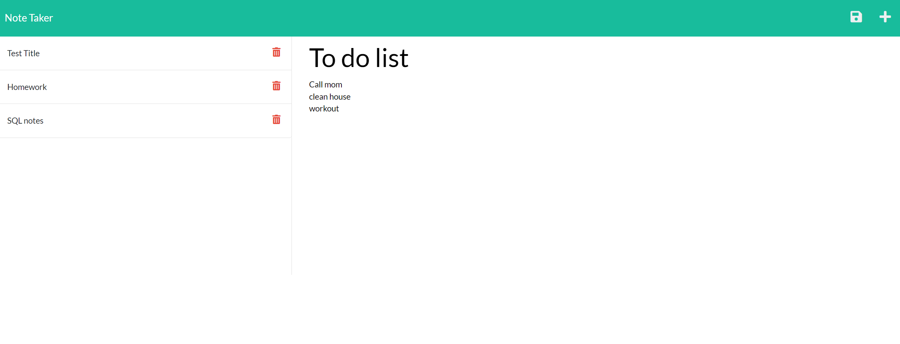

# noteTaker

## Description

To use this app simply go to the deployed app, click 'Get Started', and add information you want stored in a note. To save your note simply click the save icon in the top right corner. Now your note will be saved and it will remain there until you delete it. 
This app allows students to keep track of their notes, for busy business people to keep track of things they need to remember. 

## Credits

Front end code provided by MSU bootcamp. 